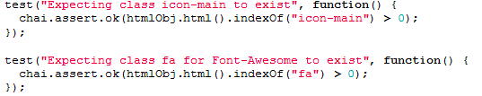
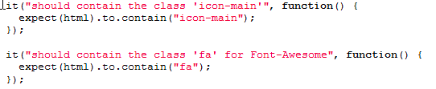
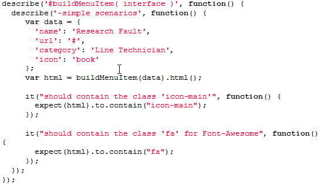
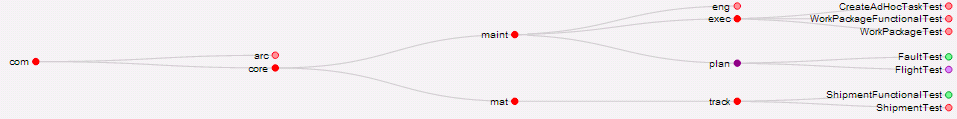

_Note: The recommendations I make in this report are specific to the contextual needs of my current team. Your mileage may vary :smiley:_

## Summary

The goal of this research was to determine tools and techniques to empower developers in unit testing JavaScript applications. The research discovered that there are three distinct aspects of JS unit testing:

*   Authoring checks: the means of writing the unit tests
*   Executing scripts: the frameworks that execute the checks
*   Reporting: displaying the execution results in a consistent and valued format

For authoring, the recommendation is to use the [Chai.js](http://chaijs.com/) library and to write checks in a behaviour driven development (BDD) format. For execution, the recommendation is to use [Mocha](http://visionmedia.github.io/mocha/#reporters) as it has the most versatility to integrate into an existing Continuous Integration (CI) system. For reporting, the recommendation is to either use [SonarQube](http://www.sonarqube.org/) if looking for tracking history and other code quality metrics, or to create a custom reporter that suits the team’s needs.

## Authoring Checks

As is typical in the JavaScript world, given any one need there exists many similar libraries and frameworks to solve the problem. This remains true for unit test helpers. To further conflate selection, some libraries offer both authorship and execution in a single framework (see Table 1).

The largest dichotomy between library selections is the supported writing style: do you want checks to be written as asserts (typically labelled at TDD for Test Driven Development) or as describing behaviour (BDD). Assertions are the more traditional pattern (see Code 1), but behavioural is more readable enabling increased visibility of risk to Product Owners and Business Analysts (see Code 2).

<table style="border:1px solid black;">
<tbody>
<tr>
<td>

 
_Code Sample 1: TDD Style Unit Testing_
</td>
</tr>
</tbody>
</table>

&nbsp;

<table style="border:1px solid black;">
<tbody>
<tr>
<td>

 
_Code Sample 2: BDD Style Unit Testing_
</td>
</tr>
</tbody>
</table>

&nbsp;

The selection of libraries and frameworks is simplified by comparing these aspects (see Table 1).

<table style="border:1px solid black;">
<thead>
<tr>
<td width="126"><b>Name</b></td>
<td width="124"><b>TDD Style</b></td>
<td width="124"><b>BDD Style</b></td>
<td width="116"><b>Authoring</b></td>
<td width="133"><b>Execution</b></td>
</tr>
</thead>
<tbody>
<tr>
<td width="126"><b>Chai.js</b></td>
<td width="124">Yes</td>
<td width="124">Yes</td>
<td width="116">Yes</td>
<td width="133">No</td>
</tr>
<tr>
<td width="126"><b>QUnit</b></td>
<td width="124">Yes</td>
<td width="124">No</td>
<td width="116">Yes</td>
<td width="133">Yes</td>
</tr>
<tr>
<td width="126"><b>Jasmine</b></td>
<td width="124">No</td>
<td width="124">Yes</td>
<td width="116">Yes</td>
<td width="133">Yes</td>
</tr>
<tr>
<td width="126"><b>Unit.js</b></td>
<td width="124">Yes</td>
<td width="124">Yes</td>
<td width="116">Yes</td>
<td width="133">No</td>
</tr>
<tr>
<td width="126"><b>Mocha</b></td>
<td width="124">No</td>
<td width="124">No</td>
<td width="116">No</td>
<td width="133">Yes</td>
</tr>
<tr>
<td width="126"><b>Test Swarm</b></td>
<td width="124">No</td>
<td width="124">No</td>
<td width="116">No</td>
<td width="133">Yes</td>
</tr>
<tr>
<td width="126"><b>Buster.js</b></td>
<td width="124">Yes</td>
<td width="124">Yes</td>
<td width="116">Yes</td>
<td width="133">Yes</td>
</tr>
<tr>
<td width="126"><b>Intern.io</b></td>
<td width="124">No</td>
<td width="124">No</td>
<td width="116">No</td>
<td width="133">Yes</td>
</tr>
</tbody>
</table>

&nbsp;

_Table 1: JavaScript Unit Test Frameworks Compared_

Basing a choice on the “[Single Responsibility Principle](http://en.wikipedia.org/wiki/Single_responsibility_principle)” a framework focused on authoring was recommended: **Chai.js**. It is versatile, supporting both TDD and BDD coding styles. It is well supported online. Most importantly, checks written using it can easily be ported to another library if so desired.

## Executing Scripts

&nbsp;

With authoring selected, the next aspect to be solved is execution of these unit test scripts. There are two primary scenarios for execution: developers verifying their programs and systems (continuous integration) checking for unexpected impacts to the system.

&nbsp;

To enable developers to verify their creations, keeping a simple workflow for execution is desired. Most Test Executors have a server based aspect (like running on a Node.js server), as well as browser based execution. The authoring of a browser executor should be intuitive for developers (see Code 3).

&nbsp;

For integrating to a system, it must support command-line execution, and offer outputs that can be fed to a reporting solution.

&nbsp;

<table style="border:1px solid black;">
<tbody>
<tr>
<td>

 
_Code Sample 3: Mocha Test Executor_
</td>
</tr>
</tbody>
</table>

For similar reasons as the selection of authoring tools, **Mocha** is recommended. It is well supported, and it would easy to port a solution to another executor if ever needed. Also, it offers the most execution output options of the frameworks considered.

## Reporting Results

Surprisingly, there are not a lot of Off-the-Shelf reporting tools for unit tests (or other automated checks) nor report output formats. There are generally two reporting formats with spotty support: [TAP](http://en.wikipedia.org/wiki/Test_Anything_Protocol) and [XUnit](http://stackoverflow.com/questions/442556/spec-for-junit-xml-output). Similarly, for reporting tools, only these three options were found: [SonarQube](http://www.sonarqube.org/), [TestLink](http://sourceforge.net/projects/testlink/), and [Smolder](http://sourceforge.net/projects/smolder/).

&nbsp;

Both Smolder and TestLink are focused on content management of test specifications, plans, and requirements. SonarQube is focused on code analysis and reporting metrics that may indicate overall product quality. For reporting, if already using one of these tools, it is worth investigating the results of integrating JavaScript unit tests. However, it may be overkill for some teams and may be difficult to migrate to a different future solution if keeping the report history is important.

&nbsp;

Since Mocha offers output in both TAP and XUnit, it could be sufficient to build a custom reporting tool that processes these outputs and displays the state of all checks. If the goal is to never leave checks failing, a custom reporter would be a better choice. It would be designed to only display information relevant to the team (see Image 1).

&nbsp;

<table style="border:1px solid black;">
<tbody>
<tr>
<td>

 
_Image 1: Custom Domain-based Unit Test Reporter_
</td>
</tr>
</tbody>
</table>
