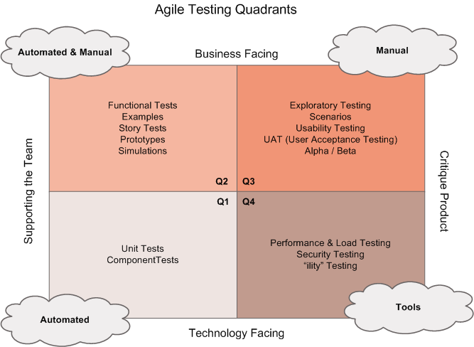
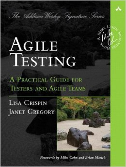

A coworker recently shared with me [this SlideShare presentation](http://www.slideshare.net/ThoughtWorks/implementingcd-4131002155842phpapp02) from ThoughtWorks.

I had never seen the Agile Testing Quadrants model by Brian Marick, but I believe it will be useful in helping me communicate types of testing to the teams. There is currently an attitude forming that "We can test everything via automation. Programmers can test it all, with more code" which is fallacious, but change takes time. I am hoping that exposing people to different models and ideas will help accelerate understanding my perspective on the value of sapient testing.

Here is the diagram I am referencing

I now have a new book added to my To Do list: [Agile Testing: A Practical Guide for Testers and Agile Teams](http://www.amazon.com/gp/product/0321534468/ref=as_li_tl?ie=UTF8&amp;camp=1789&amp;creative=390957&amp;creativeASIN=0321534468&amp;linkCode=as2&amp;tag=breacsilos-20&amp;linkId=TCLVNWFBOX4B3W3T)

Hopefully it will add even more tools to my belt for both testing software, and teaching about testing to developers.
