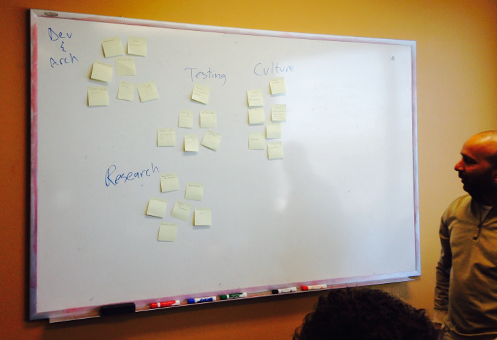
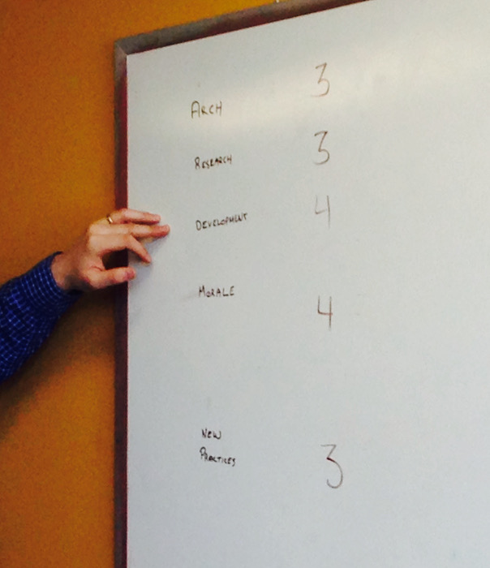
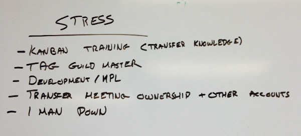
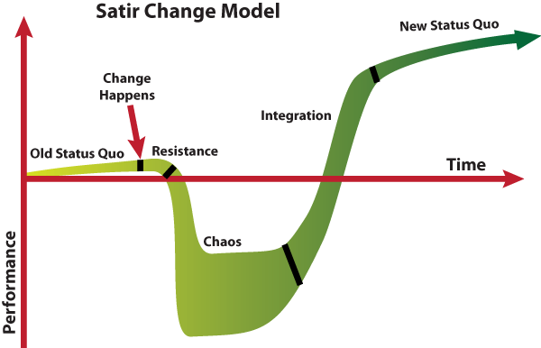

# Planning For My Departure

I have lived through the departure of many colleagues at Mxi, and each time it has been emotional and stressful. Now that it is my turn to leave, I wanted to minimize that same gut-punch to my team friends. So, like Tom Sawyer, I was able to attend my own funeral from Mxi. The weirdest part was that I played the role of meeting coordinator.

## The Agenda

As with any retrospective or post-mortem, it is important to have a skeleton of the meeting, to set expectations for attendees. Here was our plan:

* What does Jonathan do on the team?
* Which skills or roles will the team need to support?
* If the team is to hire a new member, what depicts this ideal candidate?
* What other stressors are caused by Jonathan's departure, and how can we decrease them?

## Judgement Day

After some levity about the awkwardness of this meeting, the first activity began. Individually, each team member wrote down the things they believe I had been doing on the team. I was to not participate in this ideation, forcing everyone else to reflect on my visible and invisible roles.

Once all the sticky-notes were posted on the wall, the team timeboxed 5 minutes to organize, categorize, and remove duplicates.

I was then asked to look over the ideas and comment if I saw anything missing. I did not, but was surprised by many of the roles listed by my friends, as I did not realize that I had been wearing those hats.

## Leet Skills

Our next goal was to pick which skills were most important to the team. We discussed what criteria made a skill "important" to us: was it a skill that we were going to lose, a skill we wanted a new member to encompass, or a skill the team highly values?

Once that was defined, we moved to dot-voting (5 each). We immediately removed any skill with two or less dots, so that we could focus on the most important items.

The top skills are:

* Eye for software architecture
* Researching and experimentation
* Enjoys software development (SOLID, DRY, etc)
* Positive morale
* Introduces new practices to the team

We iterated on the _Morale_ item as it is hard to hire someone matching that. We replaced it with _Personality_ focusing on _good communication skills_ and _passionate about software craftsmanship_

We discussed if there are people we know that might make good additions to the team. _"If you don't try you have already failed"_

## Stressors

We made a list of any other stresses caused by my leaving. Mostly, they relate to ownership and tribal knowledge, which are problems the team has been trying to aleviate. Each individual in the team is a special unicorn without redundancy protection.

## Conclusion

Armed with these lists, in the open and known to all, it is easier for the team to tackle the problems and to not feel alone during the transition. I work with a great set of people, and know they can achieve lofty goals. Hopefully, this session (as odd as it was for me) helps the team overcome the chaos I have introduced with my departure.

I would recommend this approach to others when faced with a disruptive change to the team dynamic, as a means of coping, communicating, and finding ways back to stability.
